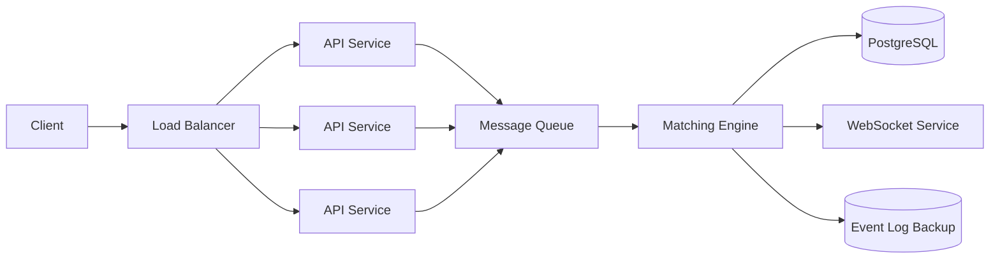

  <a href="https://github.com/0x4nud33p/exchange">
    <picture>
      
    </picture>
  </a>
   

  A fast, modular <strong>exchange</strong> backend written in Rust.

 

  
  
  
  

---

## ❓ What's Exchange?

**Exchange** is a high-performance, modular exchange system designed for speed, security, and scalability.  
Built in **Rust**, it leverages memory safety and concurrency to deliver reliable APIs for order matching, user authentication, and state management.  

It is designed as a **pluggable architecture**:  
- Separate crates/modules for authentication, Redis integration, matching engine, and APIs.  
- Easy to extend for new assets, trading pairs, or persistence backends.  

## ❄️ Architecture

